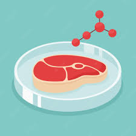

# Plotly-Belly-Button-Biodiversity
Analyzing Biodiversity
 

Tyrone Fraley 
UC Berkley Extension 
August 31, 2022 

 

  

 

## Overview of the Analysis
For this analysis I developed a dashboard through html, Javascript, bootstrap, and plotly for Roza a biological researcher. Partnering with Improbable Beef, Roza hopes to develop synthetic beef from 10 types of bacteria. Currently, there are many other sources of synthetic beef on the market that use fungi, algae, or micro organisms that can be found on plant roots. 

### Results
The dashboard is able to supply Roza and I with comprehensible data. The "Test Subject ID No" filter was created in the 
